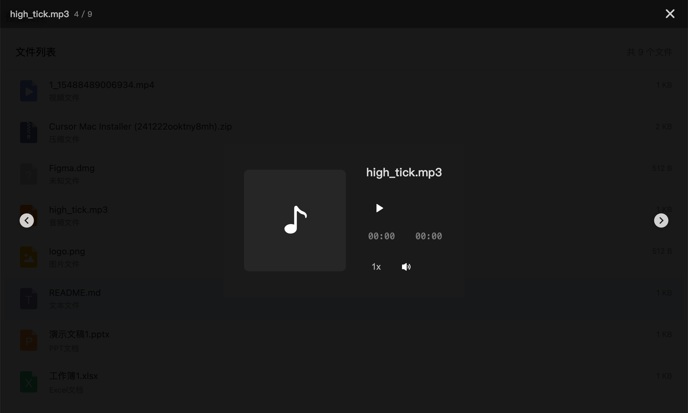
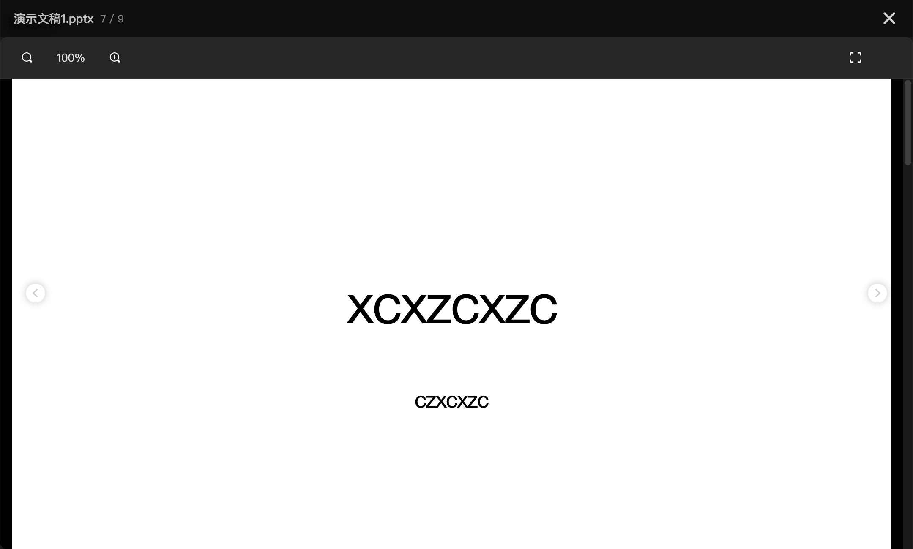
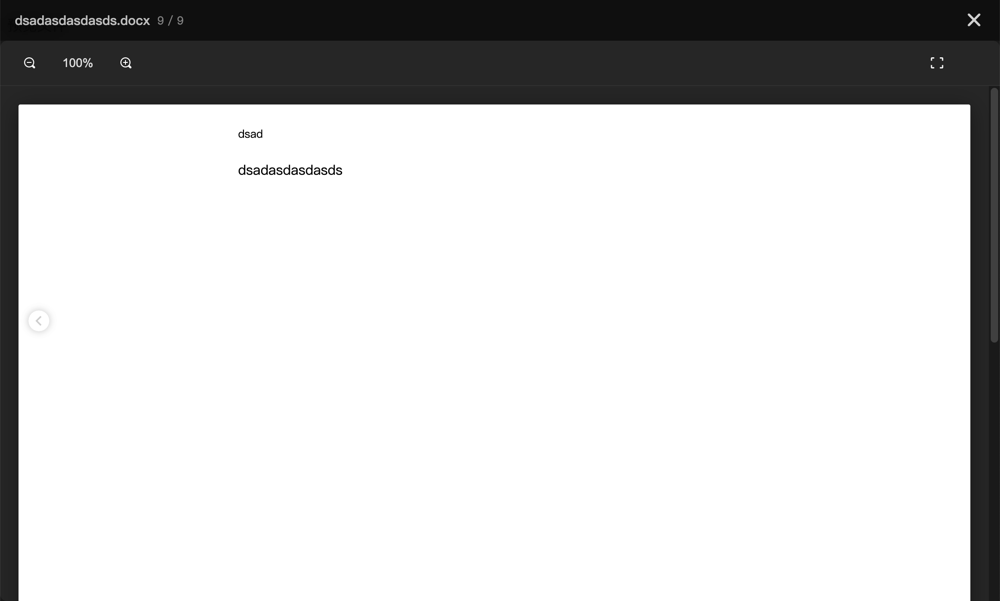
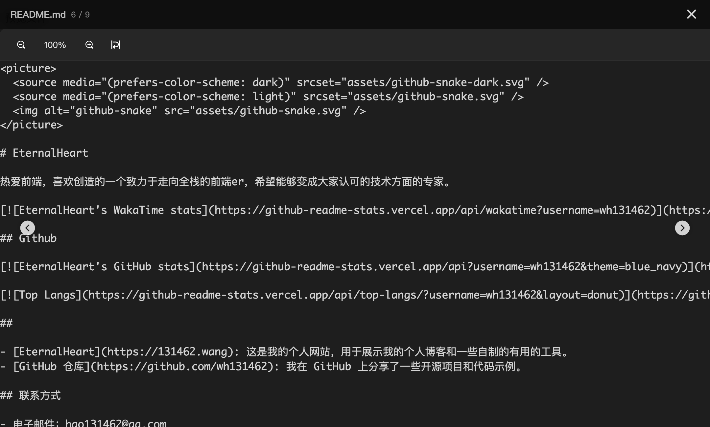
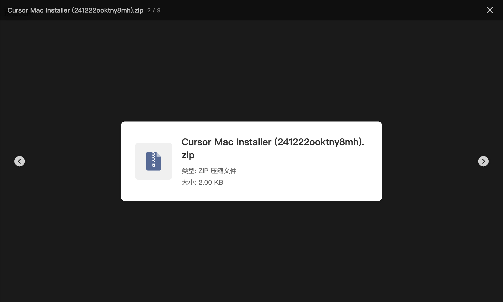
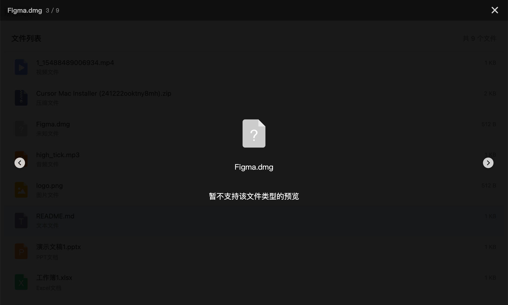

# NGX File Preview

一个功能强大的 Angular 文件预览组件库，支持多种文件格式的预览，提供灵活的自定义选项。

## 预览效果

### 默认列表视图


### 自定义模板


### 各类型文件预览效果

| 文件类型 | 预览效果                                 |
|---------|--------------------------------------|
| 图片预览 |  |
| 视频预览 |      |
| 音频预览 |      |
| PPT预览 |       |
| Word预览 |     |
| Excel预览 |   |
| 文本预览 |       |
| 压缩包预览 |       |
| 未知类型 |    |

## 特性

- 🎯 支持多种文件格式预览 (图片、PDF、PPT、Word、文本、视频等)
- 🎨 暗黑模式和浅色模式支持
- 💪 支持指令和组件两种使用方式
- 🚀 轻量级，易于集成
- 📱 响应式设计，支持移动端
- ⌨️ 支持键盘快捷操作

## 安装
```bash
npm install @eternalheart/ngx-file-preview --save docx-preview hls.js ng2-pdf-viewer pptx-preview xlsx
```

## 配置

### 1. 字体图标配置

在 `angular.json` 文件中添加必要的样式和脚本：

```json
{
  "projects": {
    "your-app": {
      "architect": {
        "build": {
          "options": {
            "styles": [
              "node_modules/@eternalheart/ngx-file-preview/assets/icon/font/iconfont.css"
            ],
            "scripts": [
              "node_modules/@eternalheart/ngx-file-preview/assets/icon/color/iconfont.js"
            ]
          }
        }
      }
    }
  }
}
```

### 2. 模块导入

在需要使用的模块中导入相关组件：

```typescript
import { 
  PreviewDirective, 
  PreviewComponent, 
  PreviewModalComponent 
} from 'ngx-file-preview';

@Component({
  // ... 其他配置
  imports: [
    PreviewDirective,
    PreviewComponent,
  ]
})
```

## 使用方法

### 1. 指令方式

最简单的使用方式，直接在元素上添加指令：

```typescript
import { PreviewDirective } from '@eternalheart/ngx-file-preview';

@Component({
  imports: [PreviewDirective],
  template: `
    <!--可以通过themeMode指定组件显示暗黑模式/浅色模式 默认按时间自动切换模式 也可以在预览页面内切换模式 -->
    <!--浅色模式-->
    <div [ngxFilePreview]="file" themeMode="light">点击预览单个文件</div>
    <!--暗黑模式-->
    <div [ngxFilePreview]="file" themeMode="dark">点击预览单个文件</div>
    <!--自动切换主题(可以自定义切换暗黑模式的时间段)-->
    <div [ngxFilePreview]="file" themeMode="auto" [autoConfig]="{dark: {
    start: 19,
    end: 7
  }}">点击预览单个文件</div>
    <!--预览文件列表-->
    <div [ngxFilePreview]="files">点击预览多个文件</div>
  `
})
export class YourComponent {
  file: PreviewFile = {
    name: 'example.jpg',
    type: 'image',
    url: 'path/to/file.jpg'
  };

  files: PreviewFile[] = [
    // ... 文件数组
  ];
}
```

### 2. 组件方式

#### 使用默认列表模板：

```typescript
import { PreviewComponent } from '@eternalheart/ngx-file-preview';

@Component({
  imports: [PreviewComponent],
  template: `
    <!--主题切换与指令的设置方式相同-->
    <ngx-file-preview 
      [files]="files"
      (fileSelect)="onFileSelect($event)">
    </ngx-file-preview>
  `
})
```

#### 使用自定义模板：

```typescript
@Component({
  template: `
    <ngx-file-preview [files]="files">
      <ng-template #itemTemplate 
                   let-file 
                   let-index="index"
                   let-isActive="isActive"
                   let-preview="preview">
        <div class="custom-item" 
             [class.active]="isActive"
             (click)="preview()">
          <span>{{ file.name }}</span>
          <span>{{ formatFileSize(file.size) }}</span>
        </div>
      </ng-template>
    </ngx-file-preview>
  `
})
```

## 文件配置

### PreviewFile 接口
```typescript
interface PreviewFile {
  url: string;          // 文件URL
  type: PreviewType;    // 文件类型
  name: string;         // 文件名
  size?: number;        // 文件大小（可选）
  lastModified?: number;// 最后修改时间（可选）
  coverUrl?: string;    // 封面图URL（视频/音频可用，可选）
}
```

### 支持的文件类型 (PreviewType)
```typescript
type PreviewType = 
  | 'image'   // 图片
  | 'pdf'     // PDF文档
  | 'ppt'     // PPT演示文稿
  | 'word'    // Word文档
  | 'txt'     // 文本文件
  | 'video'   // 视频
  | 'excel'   // Excel表格
  | 'audio'   // 音频
  | 'zip'     // 压缩包
  | 'unknown' // 未知类型
```

## 键盘快捷键

预览模式下支持以下快捷键：

- `←` 上一个文件
- `→` 下一个文件
- `Esc` 关闭预览

## 开发指南

1. 克隆项目
```bash
git clone https://github.com/wh131462/ngx-file-preview.git
```

2. 安装依赖
```bash
npm install
```

3. 启动开发服务器
```bash
npm run start
```

4. 构建库
```bash
npm run build
```

## 贡献指南

欢迎提交 Issue 和 Pull Request 来帮助改进这个项目！

## License

MIT

## 鸣谢

本项目使用了以下优秀的开源项目：

### 文档预览
- [docx-preview](https://github.com/VolodymyrBaydalka/docx-preview) - Word文档预览
- [pptx-preview](https://github.com/SheetJS/sheetjs) - PPT演示文稿预览
- [xlsx](https://github.com/SheetJS/sheetjs) - Excel表格预览
- [ng2-pdf-viewer](https://github.com/VadimDez/ng2-pdf-viewer) - PDF文档预览

### 媒体播放
- [hls.js](https://github.com/video-dev/hls.js/) - HLS视频流播放支持

感谢这些项目的贡献者们为开源社区作出的贡献！

## 依赖说明

```json
{
  "dependencies": {
    "docx-preview": "^0.3.3",
    "hls.js": "^1.4.12",
    "ng2-pdf-viewer": "^10.0.0",
    "pptx-preview": "^1.0.1",
    "xlsx": "^0.18.5"
  }
}
```

这些依赖项需要在安装 ngx-file-preview 的时候同步安装。如果您的项目中已经包含了某些依赖，可以根据需要手动管理版本。

### 可选依赖

某些预览功能需要额外的依赖支持：

- PDF预览：需要 `ng2-pdf-viewer`
- Office文档预览：需要 `docx-preview`、`pptx-preview` 和 `xlsx`
- HLS视频流：需要 `hls.js`

如果您不需要某些预览功能，可以选择不安装相应的依赖包，这样可以减小最终打包体积。
